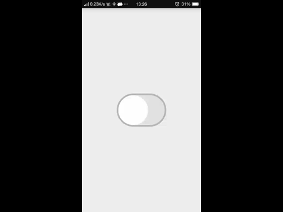

This is a library project with a custom view that implements open&close function same as CheckBox.This implements the concept of switch(<https://dribbble.com/shots/1376110-iOS7-Swith-free-After-Effects-file?list=likes&offset=0>)made by Jelio Dimitrov.

###Demo###
   
  

###Usage###  

Add the SwitchView in your layout.  

``` xml
<com.zhanglei.customizeview.SwitchView
        android:id="@+id/switch_button"
        android:layout_centerInParent="true"
        android:layout_width="150dp"
        android:layout_height="100dp" />

```  

and 

``` java
switchButton.setOnCheckedChangeListener(new SwitchView.OnCheckedChangeListener() {
            @Override
            public void onCheckedChanged(View view, boolean isChecked) {
                Toast.makeText(MainActivity.this, "isChecked: " + isChecked, Toast.LENGTH_LONG).show();
            }
        });
```